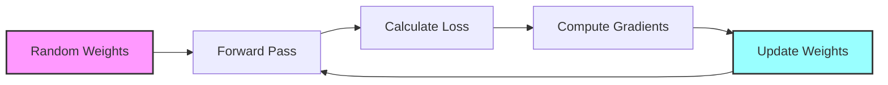

# What a One-Neuron Perceptron Taught Me About Gradient Descent

Have you ever wondered how machine learning models actually "learn"? While deep neural networks with billions of parameters grab headlines, I discovered profound insights by implementing the simplest possible neural network: a single-neuron perceptron. Here's what this tiny model taught me about the fundamental principles of machine learning.

## The Humble Beginning: A Binary Fruit Classifier

My journey began with a straightforward task: build a model to distinguish between apples and bananas based on three features:
- Length (cm)
- Weight (g)
- "Yellow score" (how yellow the fruit appears)

The dataset was tiny - just 12 fruit samples - but perfect for understanding the core mechanics of neural networks without getting lost in complexity.

## The Mathematics Behind Learning

The perceptron's architecture couldn't be simpler:
1. Take inputs (fruit features)
2. Multiply by weights
3. Add a bias term
4. Pass through an activation function (sigmoid)
5. Output a prediction between 0 and 1

```python
# The entire forward pass in just two lines
z = np.dot(X, W) + b
y_pred = sigmoid(z)
```

But the magic happens during training. Starting with random weights, the model initially makes terrible predictions. Through gradient descent, it gradually adjusts those weights to minimize prediction errors:

```python
# The core of gradient descent
dz = y_pred - y
dW = np.dot(X.T, dz) / len(y)
db = np.mean(dz)
    
# Update weights and bias
W -= learning_rate * dW
b -= learning_rate * db
```

## The Learning Rate: A Delicate Balance

The most fascinating parameter in this process is the learning rate. It functions as a control knob that determines how quickly the model updates its understanding:

- **Too small** (0.001): The model learns painfully slowly, requiring thousands of iterations
- **Too large** (1.0): The model overshoots optimal solutions, potentially never converging
- **Just right** (0.1): The model learns efficiently, converging to an accurate solution

## A Visual Representation of Learning



## The DJ-Knob Analogy

I've come to think of the learning rate as a DJ adjusting knobs on a mixing board. Turn it too little, and changes happen too slowly; turn it too much, and you overshoot the perfect sound. Finding that "sweet spot" is both art and science.

This analogy extends to human learning as well. Children learn best with the right amount of feedback - too little guidance means slow progress, while too much correction can be overwhelming. Our perceptron works the same way, starting with no knowledge and gradually improving through properly sized adjustments.

## What This Taught Me About AI

Working with this minimal model revealed that even the most complex neural networks rely on these same fundamental principles:
1. Start with a guess (random weights)
2. Measure how wrong you are (loss function)
3. Adjust in the right direction (gradient descent)
4. Repeat until satisfied (convergence)

The next time you hear about a breakthrough AI model, remember that beneath all the complexity lies this elegant, iterative learning process - a process I came to appreciate deeply through my humble one-neuron perceptron.

What simple models have taught you profound lessons about machine learning? I'd love to hear your experiences in the comments below. 